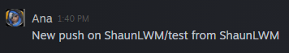

# Steam Notifications for GitHub Actions



This action allows you to send yourself a Steam message notification.

## Usage

To use the action simply add the following lines to your `.github/main.workflow` and provide the required Secrets and Environment variables.

#### YML
```
  
name: Master Push
on: [push]
jobs:
  send-msg:
    name: Send message to admin on Steam
    runs-on: ubuntu-latest
    steps:
      - name: Send Steam Message
        uses: ShaunLWM/action-steammessage@master
        env:
          STEAM_USERNAME: ${{ secrets.STEAM_USERNAME }}
          STEAM_PASSWORD: ${{ secrets.STEAM_PASSWORD }}
          STEAM_SECRET: ${{ secrets.STEAM_SECRET }}
        with:
          steamAdminId: "ENTER_YOUR_STEAM64_HERE"
          steamMessage: "New push on ${{ github.repository }} from ${{ github.actor }}"
```

### Secrets

You'll need to provide these secrets to use the action. Enter these secrets in your Settings > Secrets

* **STEAM_USERNAME**: bot username for login
* **STEAM_PASSWORD**: bot password for login
* **STEAM_SECRET**: Learn to extract your secret [here](https://github.com/SteamTimeIdler/stidler/wiki/Getting-your-%27shared_secret%27-code-for-use-with-Auto-Restarter-on-Mobile-Authentication)

### Environment Variables

You'll need to provide these environment variables to specify exactly who is receiving the notification.

* **ENTER_YOUR_STEAM64_HERE**: Enter your main account Steam64 to receive notification. Find it [here](https://steamid.io/)

## License

MIT License - Copyright (c) 2020 Shaun
